# Welcome to Ave

A world best described as chaos incarnate, this is a dystopian, ever-changing place where only the strong can survive. *A world where death is not the end*.  
Ave is unpredictable - you may walk through an icy desert for an hour, only to find a rainforest directly attached to it. There's medieval structures in flying mountains, lakes filled with black water, skyscrapers buried underground. Ave is capable of manifesting the unreal. 

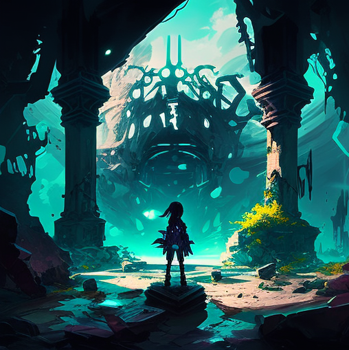

## TECHNOLOGY

The technological standards vary based on your location more than time. Ave manifests different places and ages, some of which might seem familiar to you, reaching from medieval strongholds to futuristic mega cities. Within each of these places are inventory, vehicles and weaponary befitting their surroundings.  
As such, you're able to find lightsabers and crossbows, rocket launchers and catapults, sometimes only minutes apart from each other.  
Tele- or wireless communcations don't exist, at least not over long distances, as Ave is regularly restructuring its environment, putting all efforts to build systems like these to ashes and jamms communications with huge storms. The most advanced ways of relaying information is still found in letters carried out by the world's inhabitants. As such, inhabitants from different parts of the world are very distant from one another.  
Everything exists simultaneously and resources are more often found than crafted. There's barely reason to mine for iron when there are fully operational guns out in the world, waiting to be found. 

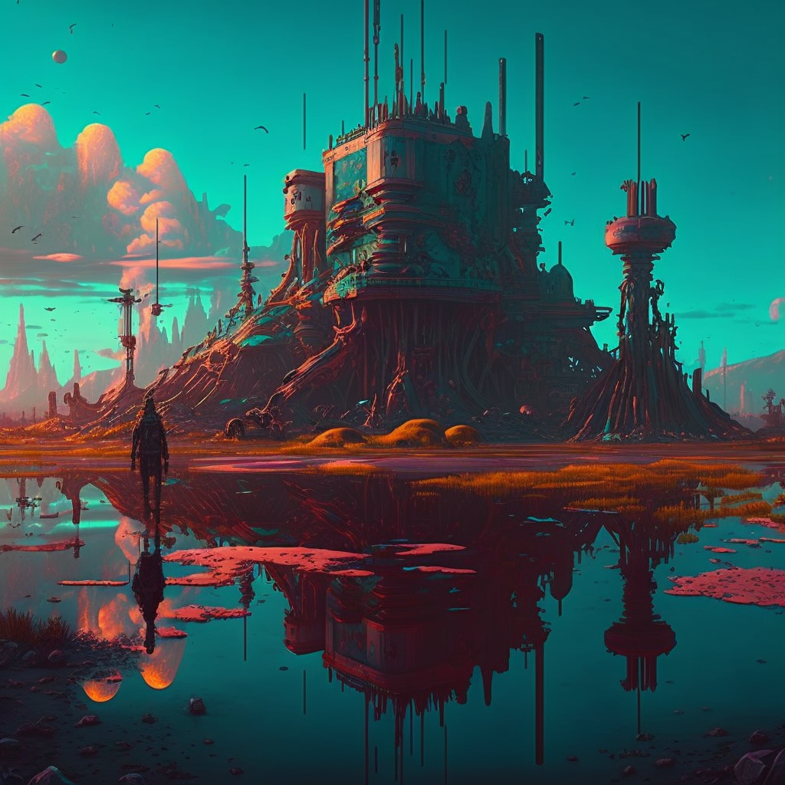

## SAFE ZONES AND THE UNSET

Ave can be categorized into two types of areas; the *set* and the *unset*. 
- In set areas, also generally known as *safe zones*, a city stays where and how it is. There simply are no changes to it that people don’t make. These zones are commonly used to build towns where people are safe from what lies outside of them. Space is limited however, and conflict is constant within the walls of a set area. 
- In an unset area, also referred to as *the outlands*, regular catastrophic so-called *geo-storms* kill everything they hail across and leave a new biome behind. Unset areas can’t be mapped, since even the highest mountains can disappear overnight. If your party ever happens to see such a storm in the distance, you should probably run to the nearest set area and wait it out. Unset areas hide great treasure; resources such as food, fuel, batteries, weapons, and more. The structures that these resources come with are the single source of everything material that is valued within Ave. But as they're no safe place to stay in for too long, and the most unregulated place in the world, they're no fun to be in for a longer period of time. 

## TERRAIN

- The world can be traversed in a car in around 20 days, including proper breaks for sleep and excluding possible inconveniences such as geo-storms or monster attacks. 
- The coastline always remains roughly the same, but anything within might change after a geo-storm changes the environment. 

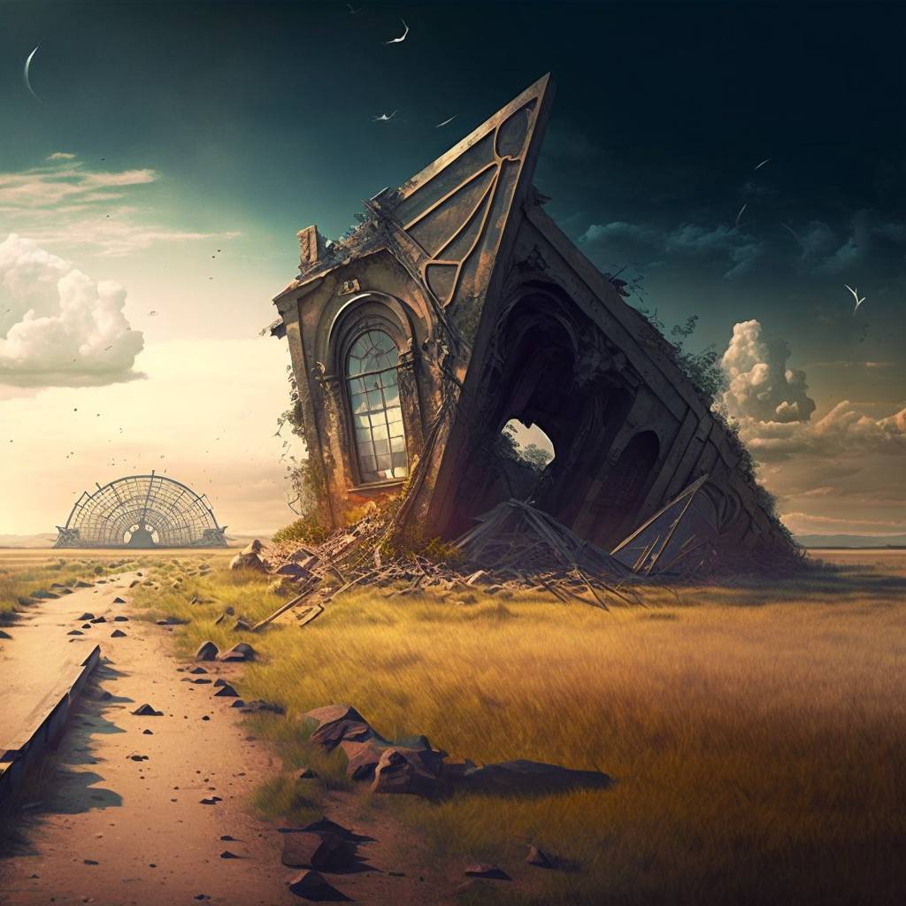

## INHABITANTS

This world is inherited by *Aveans*, humanoids that are split into *ten different races*, whereas their respective race grants them certain powers. They all look the same on the outside, but their powers allow them to burn down cities or create matter out of thin air, depending on their heritage and personal power. 
- Ave's inhabitants live about as long as humans and look just the same, while their appearance could be that of a fourteen-year-old when they actually have lived for eighty years. They themselves, much like the world they’re in, manifest their inside to the outside, if you will. While all wounds will generally mend after some time, people might carry them for as long as they retain trauma directly related to it. 
- Aveans cannot die. If one of them is killed, they will eventually return and manifest again, either in a safe distance, at a place they know well or near people they trust. This is described in further detail in the *You Will Die* chapter
- Their sturdiness, speed and strength is also based upon their inner strength and resilience. Higher ups can usually jump up on high buildings, smash each other through entire city blocks or crack open mountains with their raw physical strength, depending on how strong and experienced they are. They're sometimes god-like beings compared to the common folk. 
- Reproduction works similarly - based on will. Conception isn't made without the intent for it, which is one of the reasons - additionally to a generalized single-child rule and the hardships that come with raising a child in a world like Ave - why population doesn't grow exponentially but stays mostly stagnant. Because if it wasn't, conditions would rapidly grow worse, which would in turn decrease reproduction rates. Depending on where you live, there might even be laws regulating how many children you're allowed to give birth to. Much opposed to our world, these laws aren't frowned upon, as everyone knows what a huge problem overpopulation is in Ave already and how terrible it can get within just a few decades if left unregulated. 
- Regarding lifestyle, usually people will travel in small groups through the world or settle down in set areas and try to make a living there, though space is rare and pricey. 
- Education systems vary per location, but generally there are educational institutes that might or might not be free. Most of these are heavily regulated so that learning can take place and conflicts are taken out elsewhere. Home schooling is a much more popular form of education however, as little people stay at the same location for a long time. 
- Each inhabitant speaks the same language and trades the same coin, which is measured in *gold*. Items can also be traded with each other directly. Living costs range from 10-1000 gold per day depending on where you live. 
You can find out more about all the different inhabitants in the *Races* chapter. 

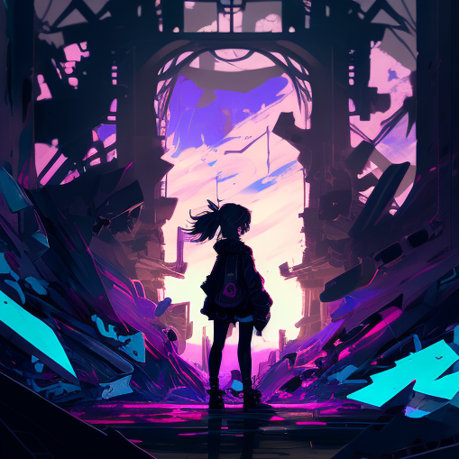

### YOU WILL DIE

Inhabitants fight. This world is far from peaceful, and there’s no generalized type of police or guard-system to ensure your safety. You will have to fight or talk your way out of trouble. You can earn insurance through respect or work to make people have your back for you, if you want to, or just fight your way through all your obstacles solo.  
One thing that is certain already is that down the line you will - eventually - still die. That just won’t be the end, as you will come back again, either stronger or weaker, depending on the circumstances surrounding your death. 
- The inhabitants of this world only perish by age. Before that they are essentially immortal, manifesting back to life after falling to ash when they are killed. That process of rebirth can take either an hour or a month, entirely dependant on how it all went down. This is unpredictable and scary for every inhabitant of Ave, as even to them, the chaotic ways of their world are something they have simply learned to accept. 
- When you die, you enter the *void*, a name that aveans have given the state between death and rebirth. You feel time pass, but can sense nothing outside of that. Only dark nothingess and empty space. It's agonizing and something inhabitants truly wish to avoid. 
- Once you return from death, you're most likely weaker than before. The void has taken a toll on your body and mind and you need to recover from it. 
 
- Once you're around 70 to 80 years old, you start to develope a sickness, the *shimmer*, as people call it. It starts as a small, harmless white spot on your skin. As time goes by, that spot grows bigger, enveloping more and more of your body. It starts to limit your movement and cripple your mind. 
- Not everyone is affected the same way, but the loss of strength and focus is inevitable for all. And, probably worst of all, they gradually lose their ability of rebirth. At some point, if someone kills them off, they remain *gone*, with no way to manifest their body back to life. 
- After the "shimmer" has enveloped their whole body, eventually it will eat away the sick host by itself, slowly causing its body to fall apart, leaving nothing but white ash. This is horrifying to watch and experience, resulting in people usually asking for a mercy killing. 
- The shimmer is the horrible fate awaiting each and every one of the inhabitants of Ave. 

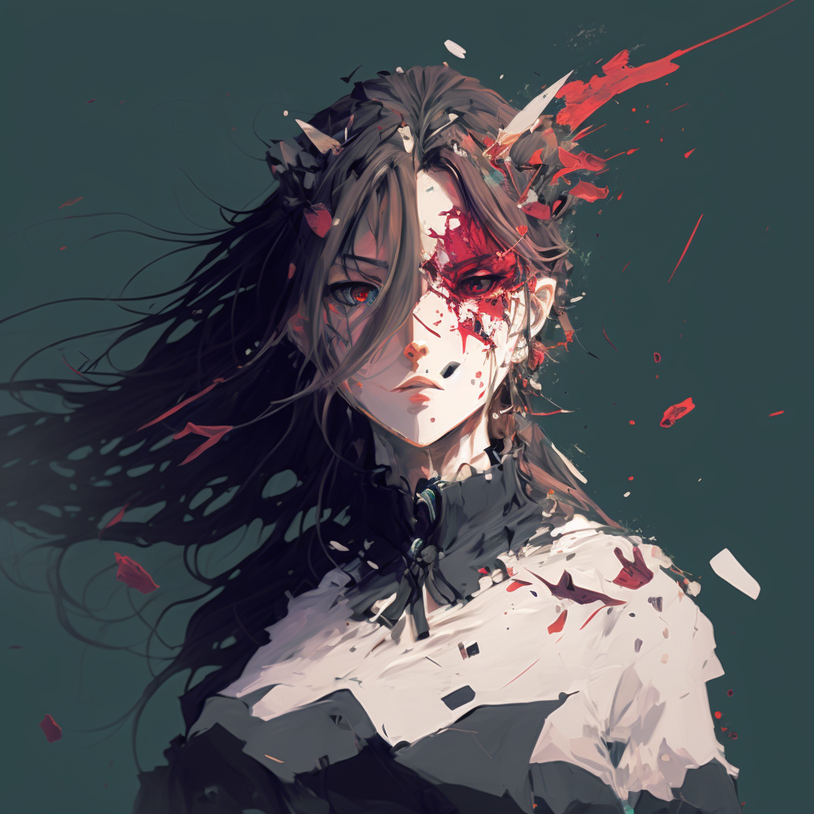

### AURA AND FOCUS

Any being in the world of Ave emits *aura*, which is a trace of their existence and intention that others might pick up on. The stronger a being is, the stronger the aura is that they emit. 
- Aura can be hidden actively. Strong beings often make use of this to remain undetected or underrated in their strength levels. 
- Aura is less of a scent and more of a feeling that you might pick up on. Meeting a monarch might make your entire body freeze if they decide to not hide their true strength. 
- Any creature can focus on picking up different auras in their surroundings. Some even passively do this, automatically detecting anyone entering their reach. 

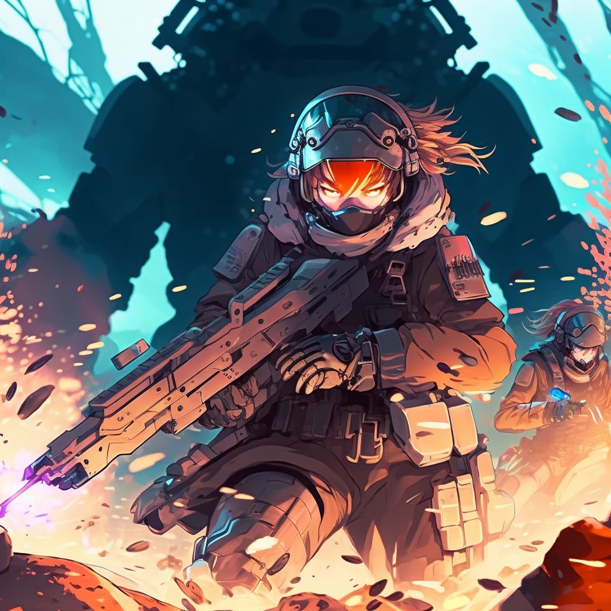

## MONSTERS

Ave is home to another set of creatures, entirely different from the ten humanoid races, the aveans, inhabiting it. These monsters come in all shapes and sizes, dark as night and high in numbers. There are some who prefer to hunt alone, but there's also hordes and swarms of them waiting for someone to enter unset areas. 
- There's little known about them, as there are countless types and they don't take being studied all too well. They're aggressive and sinister to the ten races and have made it their purpose to hunt them down for reasons unknown, as they don't require any nourishments. 
- They don't appear in safe zones and are usually kept out by the locals successfully. 
- Their blood is used to produce the drug *anti*. It needs to be harvested right after the kill, because their bodies evaporate roughly within a minute after they die. 

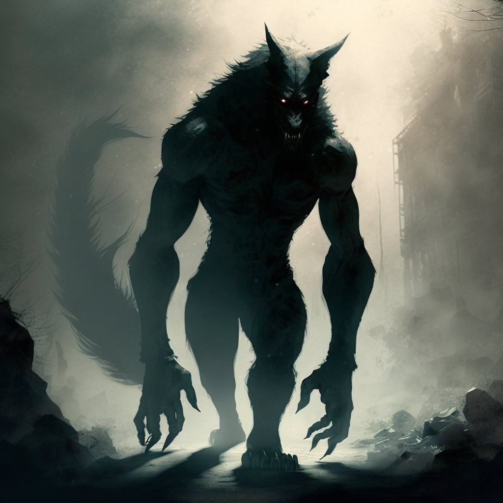

## CLEARS

Aside from aveans and monsters there's a third set of creatures, called the *clears* by aveans. They appear as a definite opposite to the monsters found outside of set areas. 
- They appear in all shapes and sizes, resembling either singular animals, or a mixture of them. 
- They're harmless unless provoked and can sometimes even take a liking to certain aveans. 
- They're neither hunted by, nor do they hunt monsters, and seem unbothered by storms. 
- To the inhabitants of Ave they're either spiritual beings, dirty animals or simply not important. Not often meddling with people, they may reside in and outside of avean safe zones, and sometimes even travel alongside certain inhabitants, having developed a close bond to them. 
- Unless forming a special bond with an avean, they're not able to return from death. 
- They all have a fairly white outside and dark eyes. 

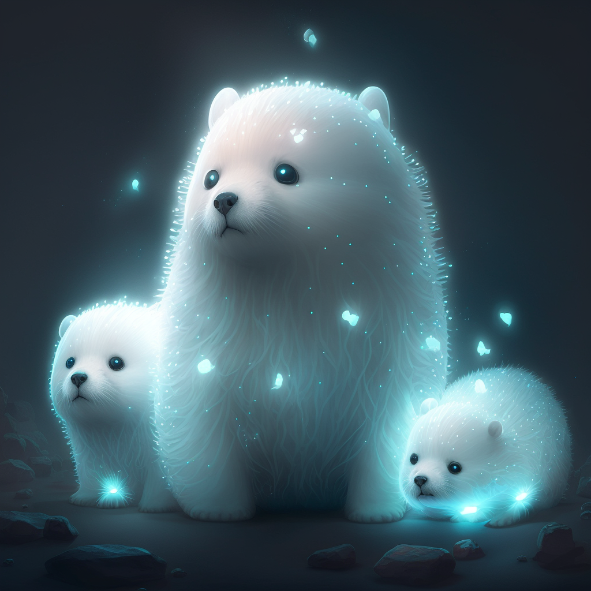

## POLITICS

The world of Ave is experiencing a shift in power about once a year. Every few years an alliance is completely reformed by their current *monarch* and their personal views, and a single fight between two or more of them can create a power vacuum big enough to cause chaos for years to follow.  
The ever-changing politics don't give Ave's inhabitants much room to breathe in-between conflict, but there are a set of rules that you can count on no matter what time your game is set in: 
- Monarchs usually rule their alliance alone. 
- An alliance mostly only accepts members from their own race to join their ranks, with rare exceptions. 
- Each alliance is able to maintain one capital city. 
- Monarchs are regularly dethroned by their own alliance. These revolutions take time, effort, and often fail, leaving behind a trail of blood and a monarch still in power. 
- The power gaps between certain ranks within alliances is so huge that a few higher ups are able to achieve what armies can't. Some of the higher ups can be considered gods. 

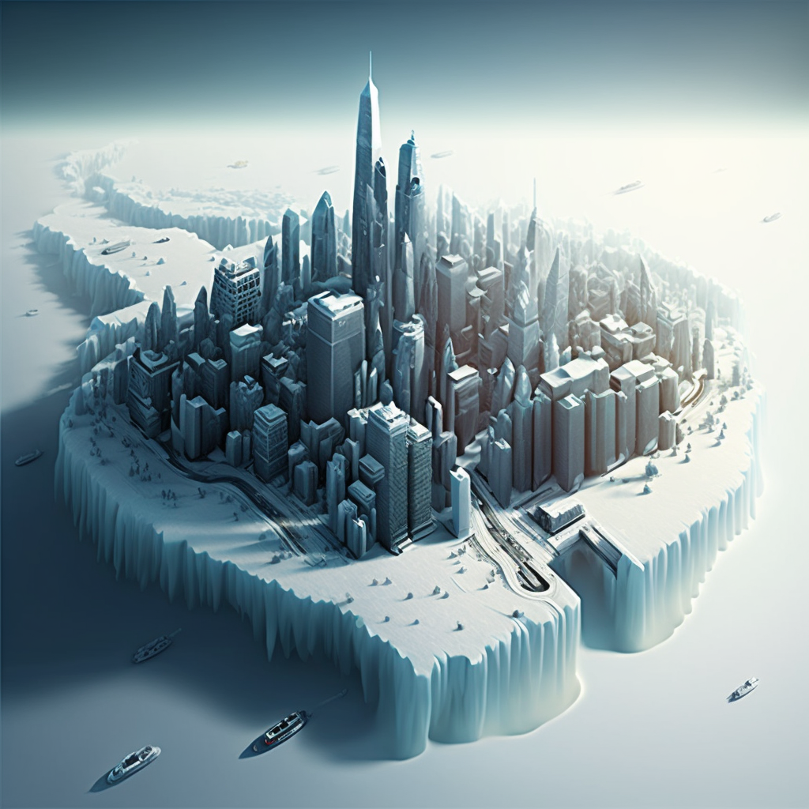

## LIFE IN AVE 

Life in Ave is generally simple to the point where you only need to be good at one of two things; talk or fight your way out of sticky situations.  

As you can't die for good, society works entirely different. Law enforcement, schooling systems, housing options, all depending on region, alliance, and more.  
The main purpose of your average inhabitant is to gain money, friends, power and personal strength. They want to stay safe by any of these means and have different ways of attaining them. 

Regarding money, the only currency is gold. In the following list you have some examples for values of certain goods and services. 
- 1G --> Most groceries
- 5G --> A round of beer for the whole group
- 50G --> A night at the local tavern or a hotel
- 500G --> A high end solar-powered laptop. 
- 5.000G --> A large van, already fueled up. 
- 50.000G --> A small one room apartment in a safe zone. 
- 500.000G --> A medium-sized company building and infrastructure. 

What you can buy with money isn't always the most important question however, usually, it is how to make that money reliably. There's several professions that have proven themselves worth their money and time in Ave, some of which are more respected than others. These are some of them: 
- Scrapper --> You go out into unset areas and scavenge for whatever you find, selling it to nomads or traders within safe zones. You're the main source of food, weaponary, ammunition, clothing and other inventory for people living inside their well-built walls. Witrhout you, everything falls, but competition is rough. You need to be prepared for anyone to stab you in the back for a handful of coins - and you might need to do the same. 
- Soldier --> You're not only part of an alliance, you're in active duty. That means you're not only coming when called for specifically, but you're always active in the field, patrolling cities, outlands or fighting for or against them. You keep people safe, or make sure they're not. You might try and go up the ranks as you become stronger to gain influence. 
- Trader --> You're either living in safe zones or travel between them and trade goods that scrappers get you. You make sure to have enough people on your side so nobody tries to mess with you and steal your goods, so you can get the right goods to anyone with the right money. You might even have a network huge enough to control an entire city block, as you've come to build a monopoly in your safe zone for certain things. 
- Shop Keeper --> A generalized profession, as a shop keeper you can be anything from a baker to a tavern-owner. You have made it far to get a nice place in a safe zone that you can now use to serve the people living there. You have regular disputes with gangs or soldiers and have a rough life trying to pay off your debt, but at the same time have made a name for yourself and people ready to keep you right where you are. 
- Hunter --> Some people are willing to pay you a good amount to track someone down and make them pay for whatever it is they've done. You're somewhat of a bounty hunter who gets paid in time to track one or more people down and off them when you get the chance to do so. You're good at finding info on your prey so you know where they might be and/or come back to life. So it is there that you wait, to make sure they don't ever mess with your client again. 
- Activist --> The world is a mess, and you need to do something about it. People are senselessly killing each other time and time again for money and power, or simply because they enjoy it. You can't look away while nations are at war because of a handful of people's disagreements, and you're trying to make a change. This profession can be financed by donations or taking from those who have too much, and result in entire revolutions taking down the current monarch of an alliance. 
- Politician --> There's two ways to rise to the top. You either fight your way up the ranks within your alliance, or you build a network and make a name for yourself by talking your way there. As a politician, you're trying to gain influence to change the world around you. There's many people either supporting you or trying to gun you down, so each of your steps must be made very carefully if you want to stay where you are. 
- Solo --> Rarely ever stepping foot into a safe zone, you make a living out of what Ave gives you by itself. You might be there because you're refusing to take part in your alliance's doings, because you were kicked out of too many towns or ticked off too many people. But in the end you're a survivalist who has lived much of his live surrounded by danger. 
- Outlaw --> You don't care about what the current alliance or townkeeper think is right or wrong, and for a good reason. You might have been wronged by someone high up the ladder or decided that it simply pays too good to refuse certain jobs. Either way, you try to stay under the authorities' radar and do what you need to do when the time comes. 
- Nomad --> There's groups of Aveans out there in unset areas who gave up on trying to live the city life. They're dodging the storms in their overtuned vehicles and come together in larger packs, sometimes even greater tribes of people that try and make a living out in the most dangerous place of the world. Plagued by monsters and savage Aveans you've learned how to sty clear from trouble, or face it when necessary. 

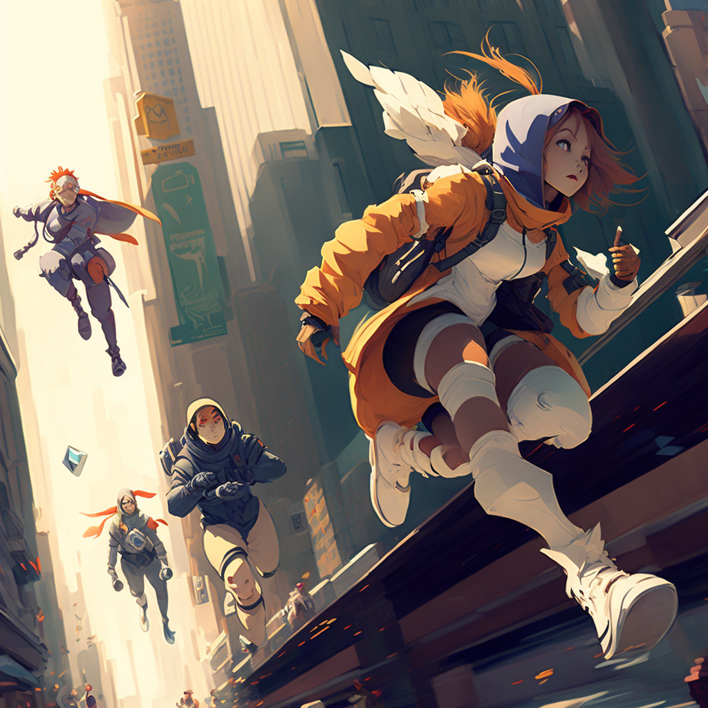

## MANIFEST MODULE

The following table depicts known information by most commoners about the current political ongoings if you play the *Manifest* module. 

| Race | Monarch | Capital City |
| ---- | ---- | --------- |
| Kara | Glaive | Moore |
| Ragin | Raku | Sly |
| Dree | Ilsen | Hamon |
| Ness | Elleen | Farphine |
| Kami | Loomis | Thana |
| Arno | Daeron | Ailnor |
| Shin | Vee | Trael |
| Zen | Elar | Raeven |
| Taro | Pera | Vesstan |
| Ahri | Fae | Crest |

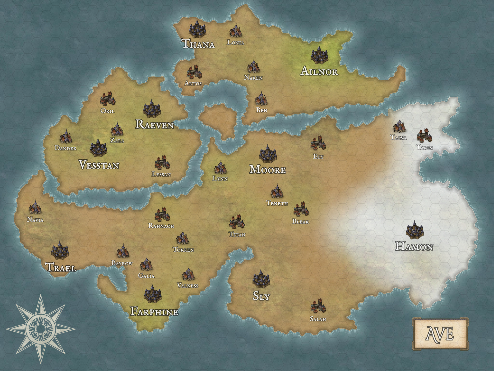