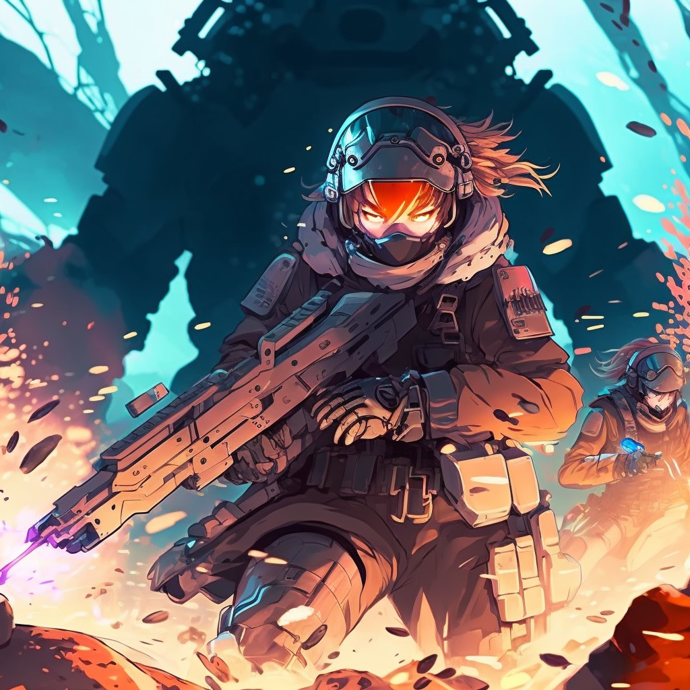

# HOW TO PLAY

## Measurement and Numbers
Distances are measured using the metric system. Your character takes up a field of 1m² and their movement speed is also measured in metres.  
When halving any number, always round up, without exceptions. 

## Skill Checks
Everything that is hard to do or can result in many different outcomes can require a dice roll. For skill checks, use your 20-sided die. 
- If you make a skill check you roll a d20 and add whatever amount of points you've spent on that skill during your character creation. You should spend your skill points based on what playstyle you have and the type of character you built. 
- Most skill checks result in a **binary outcome** - a door can either be opened or not. Others might result in **gradual outcomes** - on a mediocre charisma roll you might still gain the trust of some few villagers, as this is not an all-or-nothing situation. 
- A naturally rolled 1 will always mean you failed the check, and a naturally rolled 20 will always mean you succeeded, despite what modifiers would be added later. 
- You might gain **advantage** or **disadvantage** on some skill checks based on your race and class options, or the situation you're in. If you have advantage, simply roll your check twice and pick the best result. For rolls with a disadvantage, pick the worse outcome. 
- Advantage and disadvantage need to be granted before the roll is made. 
- **Stacking advantage and disadvantage**: If you gain advantage multiple times because of a certain combination of options for your character, add a +3 bonus to the end result instead of rolling more often for each stacked advantage. If you gain disadvantage multiple times, you get a -3 penalty for each stacked disadvantage instead. 
- You might gain **risk** on some skill checks based on your race and class options, or the situation you're in. If you roll with risk, simply roll your check twice and take the result that's the farthest away from 10. On equal results, roll again until one is more extreme. Risk negates any advantage or disadvantage previously granted. 
- If you fail a check, your GM decides how long it takes until you can try again. 

>There are 17 skills, the first 5 of which are *Combat Skills*.  
>*Ability* can also be used outside of combat. 

| Skill | Usage | 
| ---- | ---- | 
| Ranged Attack | How proficient are you with long-ranged weapons? (bows, rifles, etc.) | 
| Close-Combat Attack | How experienced are you in close-combat? (swords, staffs, etc.) | 
| Defence | Can you take a hit without getting hurt? This is a defender's check that will be used for attacks you're not aware of or that cover a wide are of effect. | 
| Dexterity | Are you more of a fast-moving type and prefer dodging hits? This is a defender's check that also affects your initiative roll. | 
| Ability | How good can you handle your birth-given powers? This is used both in and out of combat. | 
|  |  | 
| Movement | How fast are you when it comes down to it? | 
| Observance | Do you have a good sense of what’s happening around you? | 
| Stealth | How proficient are you in sneaking (and maybe stealing)? | 
| Strength | How strong are you physically? How sturdy are you? | 
| Empathize | Do you understand how other people feel? Or maybe know when they lie?  | 
| Focus | Can you detect an enemy's presence easily? Can you ignore bad conditions? | 
| Knowledge | How much do you know about the world you’re in and how it works? | 
| Intelligence | How smart are you? Can you put puzzle-pieces together easily? | 
| Charisma | How trustful are you? How much do other people like you? | 
| Intimidation | How frightening is your presence? Can you put people under pressure easily? | 
| First Aid | Would you know how to help a friend that just collapsed? | 
| Tinker | Can you tinker with old things to create new inventions? | 

## Action Economy
Action Economy is the term used to describe what you can make your character do over the course of a full round.  
It's usually ignored unless necessary due to stressful situations or characters acting against each other in a combat encounter. One turn takes 5s, and you regain expended action at the start of your next turn.

| Action Type | Usage | 
| ---- | ---- | 
| Main Action | Your most valuable action during your turn. You can attack, grapple or disarm an enemy, attempt skill checks or dash, using half your movement. You can help an ally or sabotage an enemy to grant advantage, disadvantage or risk. Main Actions are also used to end some conditions. | 
| Bonus Action | These actions are used for additional activities on your turn, depending on your racial and class choices. Every bonus action can alternatively be performed as a main action. | 
| Interaction | You can interact with one item on your turn. This includes opening doors windows, grabbing things out of your backpack and such. If any interaction requires a skill check, it is unsuccessful instead. Some interactions might be ruled as too expensive by your GM. | 
| Reaction | An action type you can use outside of your turn. You can make an Opportunity Attack when an enemy is leaving your melee range, or perform other activities based on your race and class options.  | 
| Movement | The amount of movement your character can make without taking the Dash action is decided by your level and class. For more information on movement, check out the *Movement* chapter.  | 
| Free Action | These action types can be used with no regard to the action economy on your turn. | 

## Combat Encounters
### General Combat Rules 
* Combat is turn-based, with an Initiative Roll deciding the turn order. That roll is made with a Dexterity check. 
* The higher your check is, the earlier you can start your turn. If you were the one to initiate combat, you have advantage on your Initiative Roll. 
* If characters have no way of knowing that someone's trying to attack them, they have to roll with disadvantage. That way when combat starts, people can react before the first shot is fired, but it's difficult.
* You can ready any of your Main or Bonus actions on a certain condition. Until your next turn starts, when your condition is met, you will perform that action. The wording has to be precise and edge cases are decided by the GM. 
* You're allowed to hold your entire turn, which will permanently put your initiative down for that combat session. 

* When a creature attacks, they roll for their desired attack roll (Ranged or Close-Combat) and the target creature has to roll for their desired (or required) defender roll (Defence or Dexterity). The winner of the contest gets to describe the outcome, and either prevented damage or can roll for it. 
* Field covering attacks can't be dodged with a Dexterity roll. If you're inevitably hit, you have to roll for Defence. 
* If you're unaware of an attack and thus couldn't dodge it, you're also forced to use your Defence score. 
* In the case of field-covering attacks, both Attack and Damage rolls are made once per attack, not per creature hit by the attack. 
* You can talk freely during combat, but interactions with each other and the enemy will be limited or interrupted by the GM, as combat continues. 
* If you die, you either lose or gain a skill point at your DM's discretion. 

### NPC Combat Rules
* No custom rules for NPCs as of now. 

## Conditions

### Invisibility
* An invisible creature is not 100% imperceptible. They create sounds, smell, leave footprints or have rustling equipment, and they still emit aura, which other creatures can detect. 
* A creature can try and discover the location or presence of an invisible creature for the rest of the turn as a free action, making either an Observance vs. Stealth or a Focus vs. Ability contest, at the choice of the initiator. If the contest is won by the initiator, they can now target the invisible creature for an attack and know of their presence. 
* The invisible creature can make their defender's check with advantage. 
* If an invisible creature is hit, they have to roll a Focus check vs. the attacker's initial attack roll. On a fail, they turn visible. 
* Invisible creatures have advantage on attacks rolls. 

### Blinded
- You currently are unable to see. 
- This gives you disadvantage on all combat rolls. 
- You also gain disadvantage on all other checks that require sight. 

### Incapacitated
- Your movement is reduced to 0. 
- Attacks against you are made with advantage, and you can't contest with Dexterity. 
- You cannot take any type of actions. 

### Stunned
- You gain all the effects of the Incapacitated condition. 
- Additionally, you cannot speak and are unable to move your body in any way. 

### Grappled
- Your movement is reduced to 0. 
- Attacks against you are made with advantage. 
- Attacks you make have disadvantage, unless you attack your grappler. 

### Prone
- You're lying on the ground and need half your movement speed to stand up. 

### Unconscious
- You have been knocked out and are unable to control your character unless someone wakes you up using a bonus action. 
- Alternatively, you wake up if you receive damage. 

### Exhausted
- You have disadvantage on any ability check. 
- Exhaustion can stack and give you a cumulative -3 penalty additionally to your initial disadvantage per time you receive this condition. 

## Recovery
Once in a while you will need to take some time to tend to your wounds, recover your strength and calm yourself from the heat of combat. Such a break is defined as a Rest and is bound to the following rules: 
* A rest must take at least three hours. 
* You can't perform any physically or mentally taxing tasks during your rest. 
Doing so will reset the time you need until your rest is finished again. 
* You should mention when you're about to start your rest. 
* You can also ask if you've received a rest in hindsight of downtime your characters experienced - if the GM allows for it. 
* Additionally to resting, your characters also need to sleep once in a while. Having a sleepless night will give make you *Exhausted*. 
* Not having eaten anything after by the next morning also grants you the *Exhausted* condition. 

### First Aid Kits
In your adventures you might stumble upon first aid kits. With each of these kits, you can heal up to 3d6 hit points before you run out of equipment, as these are merely used for the most necessary treatment before you can take a proper rest. They take two combat rounds to apply and you can only carry one at a time. They are not related to a First Aid skill check to stabilize a creature. 

