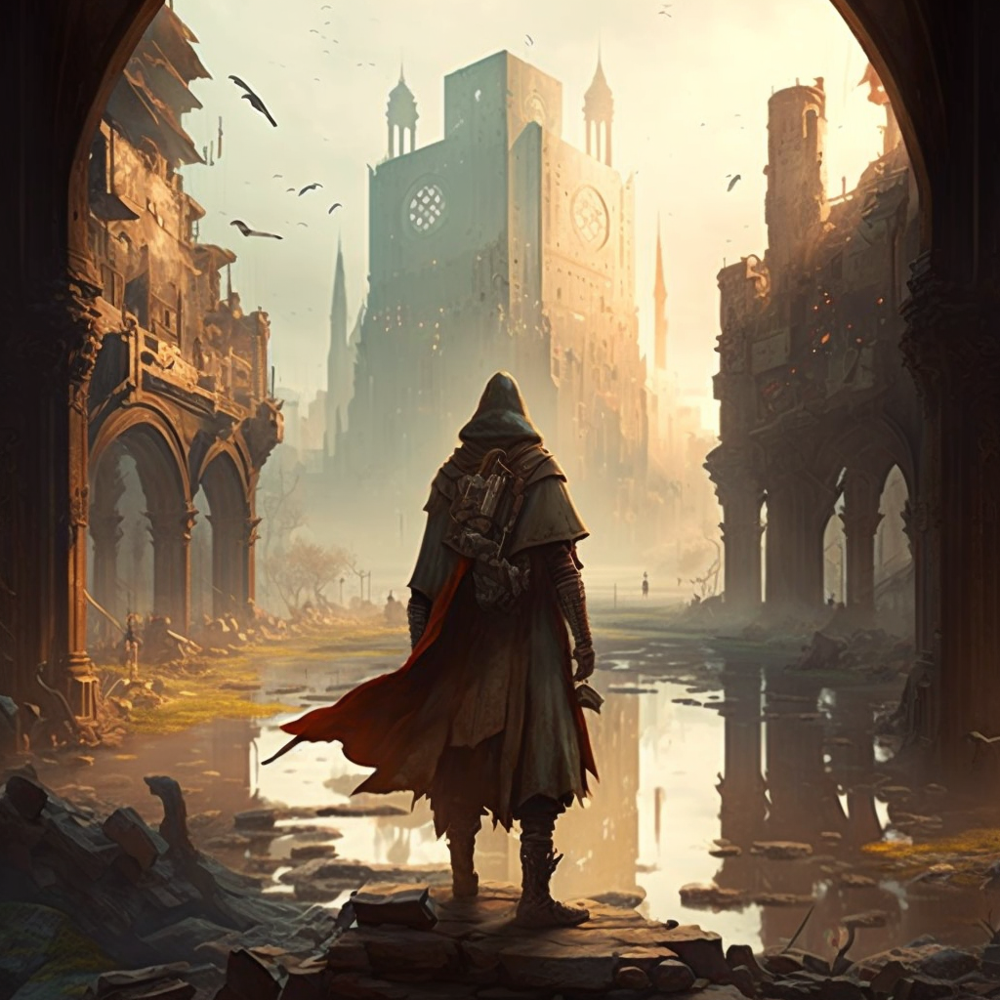
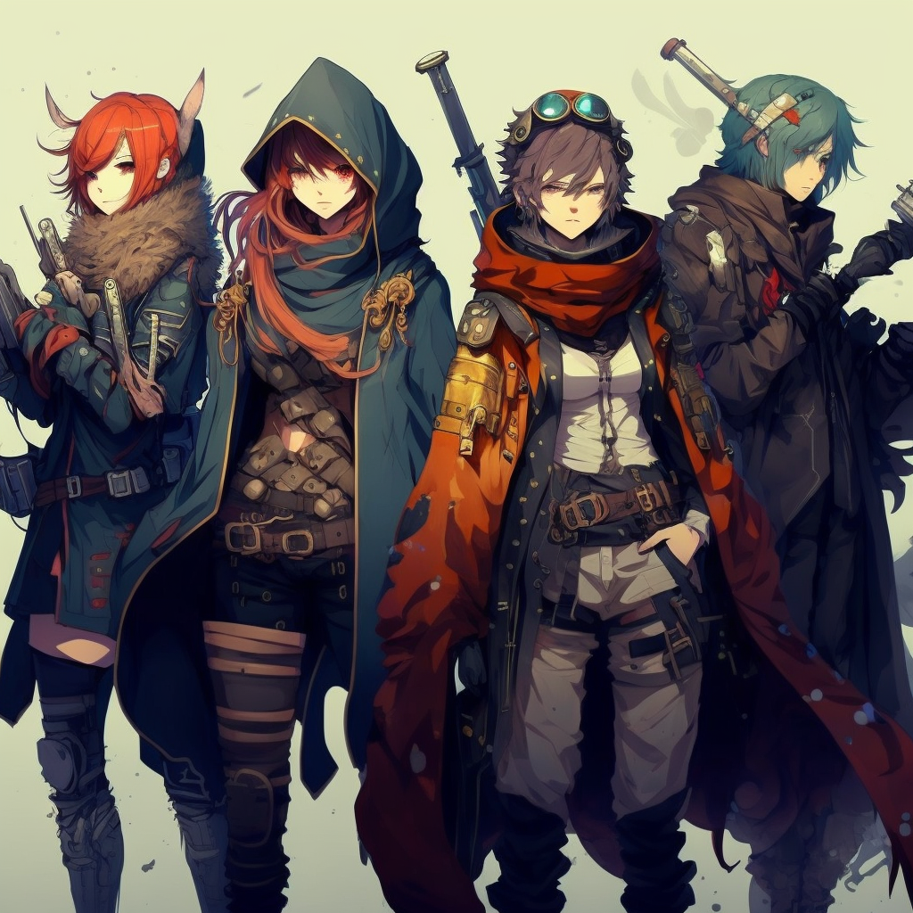

# RACES

The different avean races are at each other's throats frequently and often have strong biases towards each other, based on their way of living or overall mentality of their politics. These biases stem from an ongoing circle of hatred that has been ravaging the inhabitants of Ave for as long as they can think, and is often hard to undo. As such, a Kara will find it hard to make a living in a city ruled by the Rajin alliance, and vice versa. 
Please note that the social structures in this section are a current depiction of the biases people have and the political situation the races find themselves in. They're a small part of a big picture and don't have to represent any element of your own character. 

__Racial Abilities__

Social biases aside, each race has a set of birth-given abilities that they can further develope throughout their life. Mechanically, these abilities can be used flexibly and either deal a certain amount of damage based on your current level, or applying certain effects on yourself, other creatures or the environment that will be determined on the spot by the GM. These effects will vary on the situation and will be applied with the goal of creating a satisfying narrative experience - which does not always mean a successful action, but rather an interesting outcome. 

The following example should illustrate how such effects can be applied. 
- You're a Dree, able to create and control ice. In combat with multiple enemies, you want to make the floor below the enemies slippery so they can't follow you while you make a run for it. 
Your GM now has to decide how to handle the situation. They have several options, and should choose a satisfying and / or interesting one. 
- Give your foes a Movement contest with your Ability skill. If they succeed, they're unaffected. If they fail, they fall down and cannot crawl further than 1m until they can recontest next round. 
- Make it difficult terrain for everybody, resulting in movement being halfed. 
- Ask the player for an Ability check, with the roll deciding how effective the attempt is. On a natural 20, everyone falls flat on their face and takes 1d6 points of damage. On a natural 1, you're running out of energy and can't focus on the task at hand. In-between, a certain number of enemies will not be able to move until they succeed on a Movement check, with a DC that the GM sets. 
This should put more focus on the narrative experience of a battle and offer some fun options for combat sessions. The GM should always keep fun and excitement in mind when making a decision, and gameplay satisfaction, while a player should have trust that the outcomes of their attempted effects will be safely handled by the GM. 

## Kara

__Social Structure__  
Kara are known for aiding each other in times of trouble and sticking together tightly in their safe zones, usually not being the first ones to pick a fight. They travel Ave in greater groups of people and take comfort in high numbers. 
They're often considered to be the potentially most destructive species in Ave, able to create and control black flames that sometimes scare wild monsters off by themselves. 
Their current monarch 'Glaive' resides in Moore and has succeeded in keeping peaceful relations to other alliances for the past few years. 

__Black Flames__  
- Kara can create powerful black flames and use them for combat, dealing 1d6 points of damage per level at mid-range. 
- They can also set things on fire, though they need to concentrate on keeping the flames up actively. 
- Karas of a higher caliber can even melt things or cause explosions, although that is a trait not easily achievable. 
- Should they have enough time to rest, their wounds will close off and limbs will regrow out of fire emitting their body. 

## Rajin

__Social Structure__
Rajin are known to be spontaneous, fast-thinking and fun-seeking, often getting into trouble because of it. They have electricity-based abilities that allow them to shoot lightning bolts or power up batteries and vehicles. 
Rajin have an on-going feud with the Kara and are keen to provoking them, although rarely winning because of their more scattered and less organized nature. 
Their current monarch 'Raku' has started his reign about a year ago. He has defeated the alliance's last leader and since then prepared for war. 

__Electricity__  
- Rajin can create lightning and use it for combat, dealing 1d6 points of damage per level at mid-range. 
- They can use their electricity to power up batteries, devices and vehicles instantly. 
- Rajin of a higher caliber can even create storms around them that power up their own kind, though that is a trat not easily achievable. 
- Should they have enough time to rest, their wounds will close off and limbs will regrow out of spark emitting their body. 

## Dree

__Social Structure__
The Dree see themselves as the generally most noble race, keeping to themselves in icy deserts of their own making. They have structured patrols that freeze everything with their birth-given frost powers around their own territory to mark it, setting a sign of their strength and avoiding conflict that way. This race can create anything out of ice; at later points even moving objects and animated creatures. 
Their current monarch 'Ilsen' is known as the 'godslayer', as he took on two former monarchs years ago upon being attacked on his turf. His name alone keeps other forces away since then. 

__Frost__  
- A Dree can create anything out of ice, from weapons to lockpicks, and do not feel the cold. If they attack with weapons made of ice in combat, they deal 1d6 points of damage per level. 
- They can use their frost abilities more creatively to spontaneously create a stronger armor or freeze enemies. 
- On higher levels, Dree can create animated objects out of ice that respond to their commands, though that is a feat not easily achievable. 
- Should they have enough time to rest, their wounds will close off and limbs will regrow out of ice, slowly turning into flesh later on. 

## Ness

__Social Structure__
Ness are seen as conflict-avoiding, not often participating in fights unless they're directly threatened. They're essentially made of water, which grants them several benefits in- and outside of combat. They're difficult to pin and harder to keep down. 
The only reason why they've been so semi-successful at avoiding conflicts is rooted in their upbringing. While other races tend to teach their younglings how to be strong and win, they're taught to be smart and not participate in games they can't win in. 
Their alliance may currently not be the most ambitious one, but their monarch, 'Elleen', has been a staple of peace for her people, and a symbol of hope for a better world. 

__Aquatic Body__  
- They can control small liquid bodies of water and use those in combat, dealing 1d6 points of damage per level. 
- Their body can turn into liquid at any moment to avoid fall damage, get through tight spots or hide. 
- On higher levels, Ness can control their enemies through blood-control for a short time, though that is a feat not easily achievable. 
- Should they have enough time to rest, their wounds will close off and limbs will reform out of water. 

## Kami

__Social Structure__
Kami tend to be super-charged with energy at all times, and just as jumpy as their ability; teleportation. 
They're able to teleport, leaving behind only a quick flash of light. 
People tend to not think of Kami as dangerous, because they absolutely dominate the information network of the world with the sheer travel speed that their ability grants them. They're the fastest way of relaying important information reliably, as planes and cars are spotted way easier and pinned down quicker than a single person teleporting around every obstacle they encounter. But for that reason they can also be deemed very dangerous, because if something's going on in the world, you can trust the Kami alliance to know about it in great detail. 
Their current monarch, 'Loomis', is currently ruling said network and alliance, keeping messengers in stations placed in all major cities. For that reason, people prefer to be friendly with him. 

__Teleportation__
- Lightborns can teleport up to 6m, plus twice their level in m --> Thus, a level 1 character can teleport 8m, and a level 2 character 10m. 
- Their teleportation distance is halfed (rounded up) each time they use it, and doubles back up until it reaches its maximum distance again each turn the Kami doesn't use their ability. 
- Their teleportation leaves a flash of light which can burn very bright if the Kami is of a higher level. Some high tier Kami use this ability isolated to light up the night for multiple seconds with one single teleportation. 
- Should they have enough time to rest, their wounds will start to glow and slowly mend back to health. 

## Arno

__Social Structure__
Arno are known to be very distanced creatures, often avoiding big groups of people and tending to themselves in relative isolation where possible. Not to say they're not organized however, as the area they dominate with their plant-based abilities rivals that of the Dree. 
They can create vines and vegetations that either trap, hurt, block off or devour their enemies, or simply breathe some life into their environment. 
Their current monarch, 'Daeron', has only recently taken over control and has had a much more aggressive way of handling things than most of his predecessors. 

__Plant Life__  
- Arno can create plants out of nowhere around them. Those creations can be used in combat, dealing 1d6 points of damage per level. 
- They can also use their plants more creatively to detect structures in their environment, set traps, or change their environment in a meaningful way. 
- High tier Arnos are even capable of creating an entire forest if they want to, though that is a feat not easily achievable. 
- Should they have enough time to rest, plants will grow out of their wounds and mend their body back together. 

## Shin

__Social Structure__
This race is probably the most frowned upon by all others, reason being the nature of their abilities. Shin can create illusions to perfectly trick even the sharpest minds, so even if unused, a great seed of distrust is planted in the world of Ave simply because they exist. 
They can fake anything from small magic tricks to disguising themselves as someone else, and it's hard to look through an ability like that. When illusions prove to be fake, it will collapse in itself and dissolve into green fog. 
The Shin's current monarch, 'Vee', is not hiding her intentions of slowly taking over Ave, creating even more enemies for her and her alliance. 

__Illusionist__  
- Shin can create minor illusions around themselves. This includes things such as changing your clothing, making clears appear, faking injuries, weapons, hiding objects or similar things. When the illusion is discovered and touched, it will fade into green fog. Faking acoustics is not possible for a Shin, limiting their abilities of deceival. 
- Shin can disguise a creature as something or someone else, or make them invisible while not in motion. 
- High tier Shin are said to be able to give their illusions substance to some degree, though that is a feat not easily achievable. 
- Should they have enough time to rest, wounds will close off after eminating green fog. 

## Zen

__Social Structure__
Zen are among the most trusted folks out there, mainly because of their social nature and lightheartedness associated with them. For many years the gates of the Zen have been open, with all alliances being allowed in their cities, who are probably the most unregulated safe zones out there. 
They can create and manipulate sound with their thoughts alone to great capacities, even hurting enemies if they intend to with sheer air pressure. 
Their current monarch, 'Elar', is lacking what most other monarchs have; ambition. She has managed to hold her position for many years however, making the Zen both uninteresting and uninterested in other races' affairs. 

__Acoustics__
- Zen can create sounds with their sheer thoughts. Anything they can imagine can be acoustically produced around them. They can do this to an extent that will hurt creatures in combat, dealing 1d6 points of damage per level. Aside from other Zen, no creature in near range is immune to the damage, however. 
- They can also manipulate sounds to appear louder, more quiet or totally mute. 
- High level Zen can hear noises from incredibly far away, and produce sounds anywhere in their line of sight, even far away from them, though those are feats not easily achievable. 
- Should they have enough time to rest, wounds will close off after eminating blue light. 

## Taro

__Social Structure__
Taro are known to be the most hard to kill creatures alongside the Ness. 
Their bodies are made of metal and they can reforge parts of them into weapons, or cloak themselves under a layer of natural armour. As they are so hard to kill, they're iconically known to travel in groups of two through the world of Ave. Enough to keep themselves alive, not enough to cause serious issues. 
Their current monarch is called 'Pera', known to be focussed on defending what they have rather than risk it in wars. This way of living in Ave has been tradition for the Taro for long enough to be burned into most of their ethics. They have recently taken over new territory however, after being attacked by the Shin and striking back at full force. 

__Born Weapon__  
- Taro can manipulate their body to spontaneously form giant weapons out of them, or cloak themselves in a layer of armor. In combat, those deal 1d6 points of damage per level, but need to remain attached to the body. If thrown, the attacking Taro takes 1d6 points of damage per projectile thrown or shot. 
- They can also use their powers to create small objects such as lockpicks, or crack open heavy iron doors. 
- High tier Taros are known to be an immovable force, stopping trains with their sheer defensive might by just standing in their way. 
- Should they have enough time to rest, wounds will mend with a metal layer that will slowly become flesh again. 

## Ahri

__Social Structure__
Ahri have accumulated a lot of influence through collaborating with different races on a great scale, and have made both friends and enemies in doing so. They tend to profit off war by dealing in what's needed the most currently. They live in small cities that are cut off mountain tips with structures placed on top of them. They do so above the ground and far from conflict - the only problem being their lack of safe zones. So they help out different alliances at different times in various tasks for what's essentially a rental above their cities when geo storms are incoming. 
This race can defy gravity for themselves and others, make objects or entire cities float depending on their strength level and chain their enemies to the ground. They tend to live exclusively on their floating biomes and evade battles if possible, as they're not the naturally most offensive group of people. 
Their current monarch 'Fae' is part of a very powerful bloodline among the Ahri, with an important difference to other alliances; she's been elected by her people. Fae's entire bloodline is known to be irregularly strong, and she's been a natural leader from an early age, which suited the diplomatic, if capitalistic nature of the Ahri. 

__Levitate__  
- Ahri can make up to 100kg per level float. These can be multiple objects. They act unaffected by gravity. They can also decide to merely increase or lessen the gravity of other creatures or objects. 
- Ahri can gravitationally connect multiple things they touch, though they need to concentrate on it to uphold that connection. 
- At higher levels, Ahri are known to control incredibly huge objects and being able to steer them. That is how their cities float and move towards their destinations fast enough to outspeed geo-storms for a limited amount of time. 
- Should they have enough time to rest, wounds will mend after emitting purple light. 