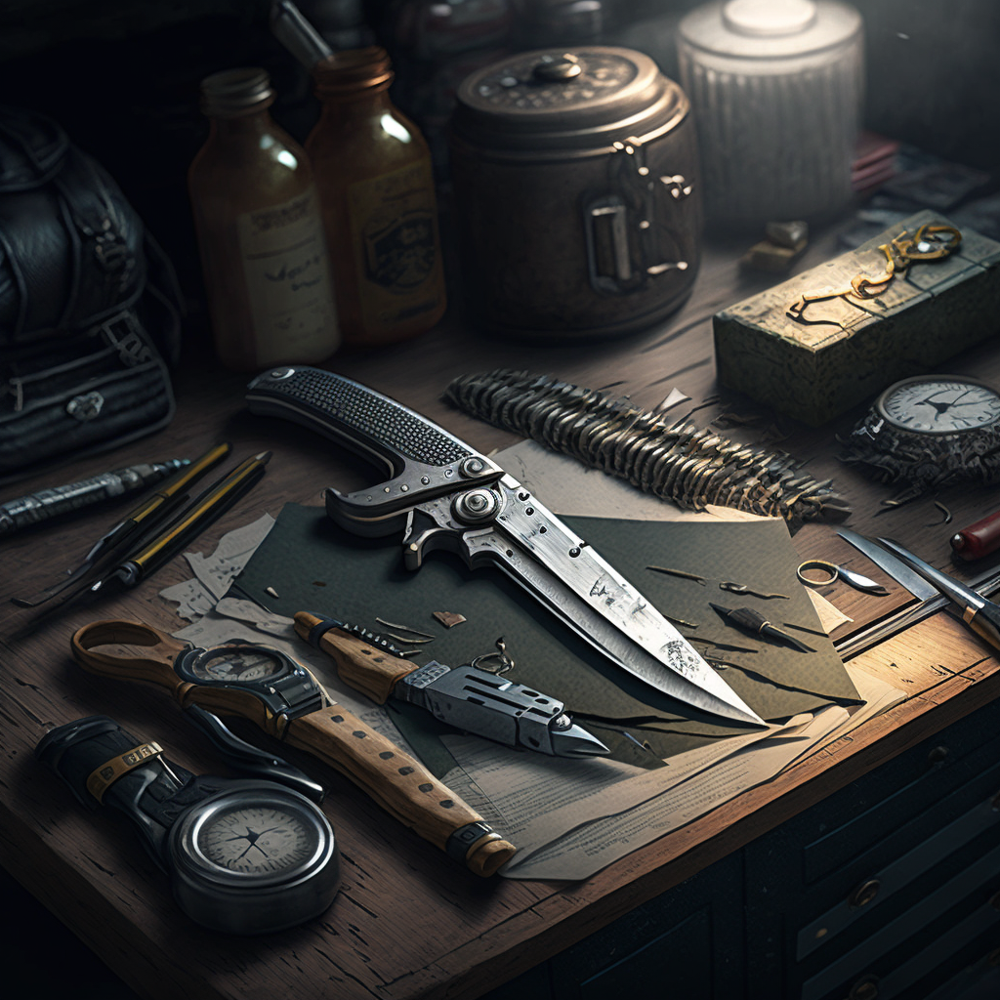

# Weapons

* Ranged weapons deal 1d6 damage per hit, no matter what type. Reloading happens outside of the action economy, but is welcome to be described as flavour during combat. 
* Close-combat weapons deal 1d6 damage per hit, no matter what type. 
* Fighting close-combat gives you a +2 modifier on Dexterity and Defence checks as you're harder to hit. 
* Damage scales up as 1d6 per level. 
* You can use parts of your body as close-combat weapons, but it has to be the main fighting style of your character. If you usually fight with weapons, your body counts as an improvised weapon. 
* Improvised weapons (e.g. a bottle from the bar you grabbed out of necessity) behave similar to regular weapons, but the damage you rolled for will be halved, rounded up. 
* Stationary weapons, such as heavy mounted machine guns, apply 1d6 additional damage and have a +2 bonus to hit. 
* Grenades have a range of 3m and apply 1d6 points of damage per level you have. You can throw them 4m far, plus your current level and your Strength skill modifier. 

Weapons can take any shape and size in the world of Ave. Here are some examples: 
* Handgun, Machine Gun, Shotgun, Bazooka
* Taser, Baton, Quarterstaff, Whip
* Knive, Sword, Spear, Axe
* Chainsaw, Nail Gun, Purse, Screwdriver
* Blaster, Lightsaber

