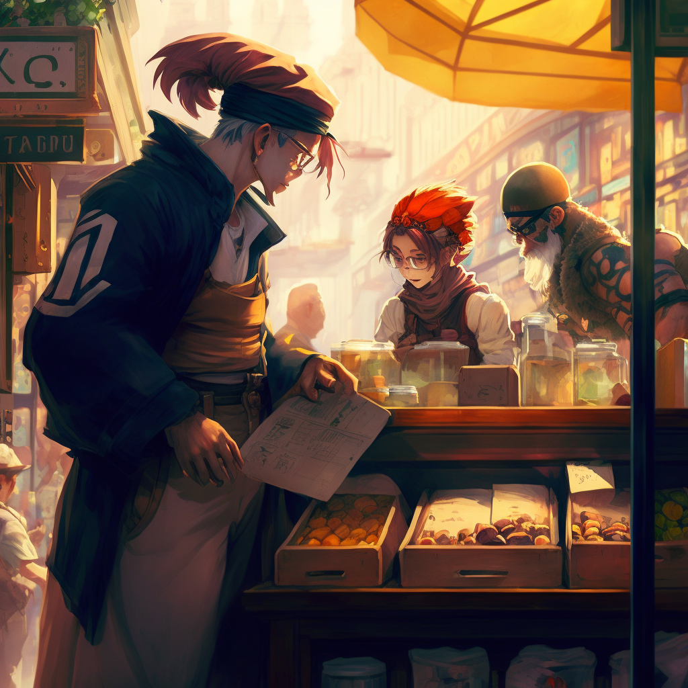

# Equipment
Each *weapon of your choice* can be replaced by 5 grenades, all of which can be of a different kind. 

## Mechanic's Kit:

- Two weapons of your choice
- A backpack or similar storing accessory
- A bedroll
- A set of clothes
- A pouch with 100G
- A mechanic's toolbox
- Extra batteries to be used for cars or other devices
- 2 bottles of oil
- Hacking interface
	
## Scholar's Kit:

- One weapon of your choice
- A backpack or similar storing accessory
- A bedroll
- A set of clothes
- A pouch with 200G
- Pen and Paper
- A book containing lore
- 10 flares
- Binoculars
	
## Explorer's Kit: 

- Two weapons of your choice
- A backpack or similar storing accessory
- A bedroll
- A set of clothes
- A pouch with 100G
- A lighter
- A flashlight or reusable torch
- A grappling hook and 10m of rope
- A non-lethal hunting trap

## Urbanite's Kit: 

- One weapon of your choice
- A backpack or similar storing accessory
- A bedroll
- A set of clothes
- A pouch with 150G
- A lighter
- Lockpick tools
- 2 bottles of oil
- 2 bottles containing marbles