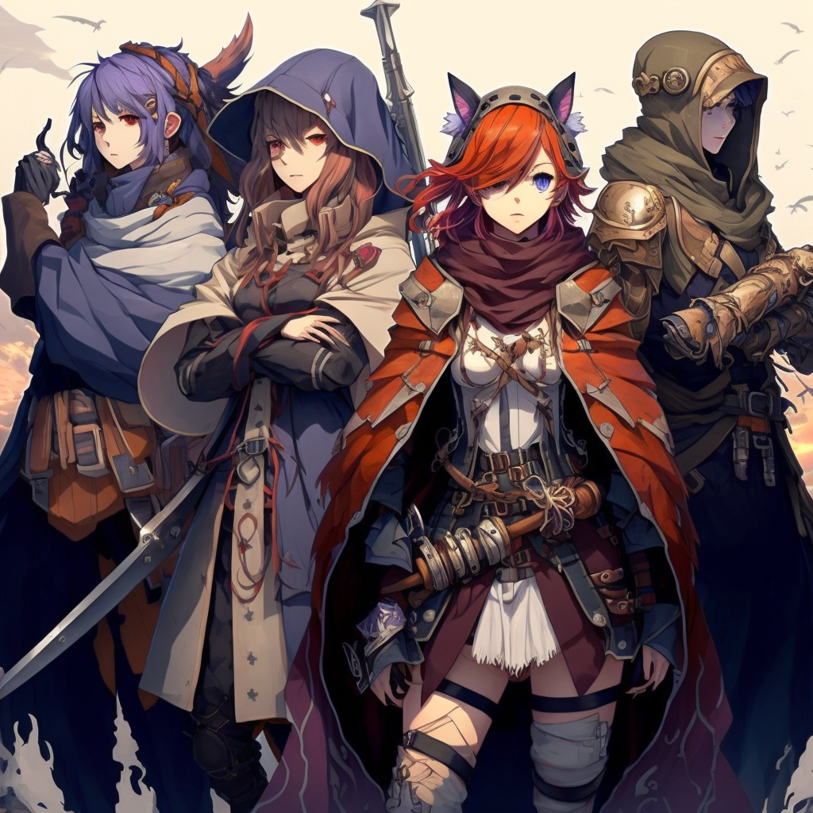

# Character Sheet

A handy dandy online tool exists to create and manage character sheets at [squadspawn.rynkbit.net](https://squadspawn.rynkbit.net).
In order to associate character sheets with a person, the app uses Google Single-Sign-On.
Therefore, a Google Account is required to use it.
The login process is done inside a pop-up, which might get blocked depending on the browser that is used.
In that event, the website must be explicitly allowed to open pop-ups.

Credits to [Michi](https://github.com/meik99) for creating, maintaining and hosting that service for exposure. 

> Note: If the domain above is not accessible, it might still be accessibly using [infallible-pike-0aad6e.netlify.app](https://infallible-pike-0aad6e.netlify.app/) instead.
> This is usually the case if [_someone_](https://github.com/meik99) forgets to renew the domain.
